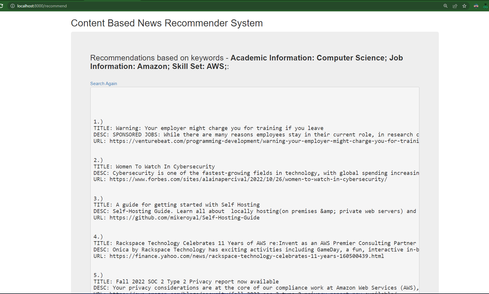

# Content Bases Recommender System
Content Bases Recommender System for News Recommendation Based on Professional Profile of a user

1. The Content Bases Recommender System is built using FastAPI and newsapi.org's API. 

2. The user is asked details such as, his/her academic, work and skill set information.

3. These entered details are then used to make an API call to newsapi.org's API to fetch the related news articles.

4. These fetched articles are then processed and their corresponding TF, IDF and TFIDF scores are calculated on the basis on which they are ranked.

5. Once the ranking is performed they are then returned to the user.

6. How to deploy/run the application:
	a. On opening and running the app.py Python file on any IDE or console, an Uvicorn server starts running on http:/localhost:8000
	
	b. To run the Webapp, open http:/localhost:8000 on any browser.
	
	c. "index.html" webpage is rendered. Here, enter the profile details and press submit or hit "Enter".
	
	d. The app then navigates to "recommendations.html" and renders the user details and the ranked search results for news articles.
	
	e. Press "Search Again" to search for a new entry.
	

Screenshots:
1. 
2. 
3. 

